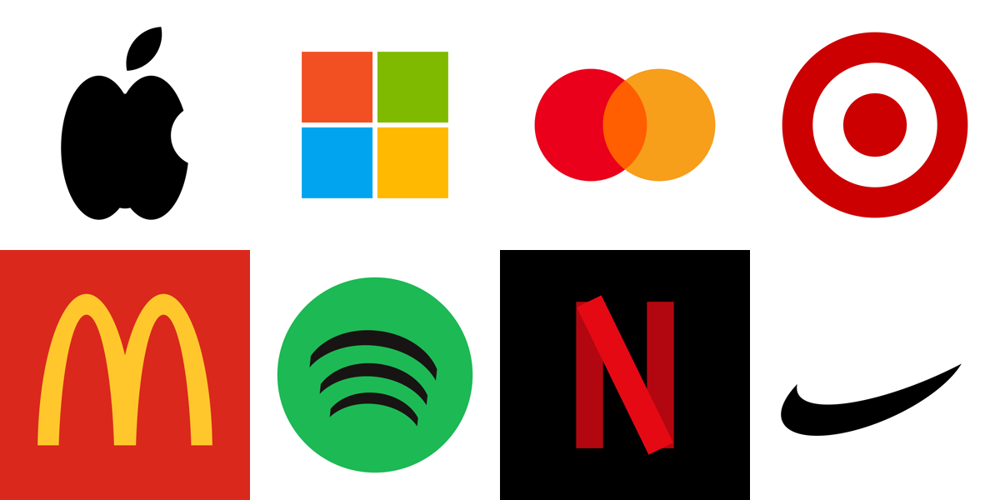

# pixelmator-skill

**Moved.** This now lives inside Samantha, our own assistant: [turing/pixelmator](https://github.com/nulljosh/turing/tree/main/pixelmator). See her paint at [turing.heyitsmejosh.com/paint](https://turing.heyitsmejosh.com/paint/). This repo stays as a snapshot.

 

Describe a logo. Watch Pixelmator Pro build it, layer by layer.

Image generators hand you a flat picture. You can't edit it. You can't see how it was made.
This is different. Claude writes a small JSON spec. One script turns it into AppleScript and drives the real app on your Mac.
Every oval, letter and star lands as its own editable layer. Then it exports the file and checks its own work.



All eight were built inside Pixelmator Pro from the specs in `examples/`. A few seconds each.
They are approximations made from ovals and rectangles, shown to demonstrate the tool. The marks belong to their owners.


## It paints too


That is the Mona Lisa, built inside Pixelmator Pro from 3000 rectangles. Every one is a real layer.
No model draws it. Start with one rectangle in the average color. Find the cell that is most wrong. Split it in four. Repeat.
The face gets thousands of tiny layers. The background gets a handful.

```bash
python3 pxm.py paint photo.jpg --out painting.png --shapes 3000 --gif build.gif
```

## Use it

```bash
python3 pxm.py check                                  # is this Mac ready?
python3 pxm.py logo examples/badge.json               # build it on screen
python3 pxm.py logo examples/apple.json --headless    # same build, app stays in the background
python3 pxm.py logo examples/nike.json --gif out/nike.gif   # plus a GIF of the build
```

Needs macOS, Pixelmator Pro and python3. Nothing to install. `--gif` needs ffmpeg.

As a Claude skill: symlink this folder to `~/.claude/skills/pixelmator`. `SKILL.md` has the full spec.

## Features

- Shapes, text, strokes, rotation, opacity, center anchoring for text on a curve.
- `cutout` layers: curves without a pen tool. Add, subtract and intersect ovals, get one vector shape.
- Export to png, jpg, svg, pdf, psd, pxd and more.
- `paint`: any image rebuilt from thousands of shape layers.
- Headless mode. Build GIFs.

## When things go wrong

That is most of the code. The spec is validated before the app is touched, and every bad key is listed at once.
AppleScript error numbers become plain sentences with a fix. A half-built document is closed, never left behind.
After the run it trusts nothing: layer count, export size, and fonts are checked, because Pixelmator swaps in Helvetica for an unknown font without a word.

| Exit | Meaning |
|---|---|
| 0 | Built, exported, verified |
| 2 | Bad spec |
| 3 | Mac not ready (app missing, Automation permission) |
| 4 | Pixelmator refused a step |
| 5 | Ran, but the result is wrong |

## Tests and CI

```bash
python3 -m unittest -v               # unit tests. No Mac needed
PXM_LIVE=1 python3 -m unittest -v    # also drives the real app
```

CI is a robot that runs the tests on every push, on clean machines, so "works on my Mac" is never the only proof.
Here it runs on Linux and macOS, on Python 3.9 and 3.13, and lints with ruff. GitHub's machines have no Pixelmator Pro,
so CI proves everything up to the app and the live tests prove the rest. See `.github/workflows/test.yml`.

MIT 2026 Joshua Trommel
